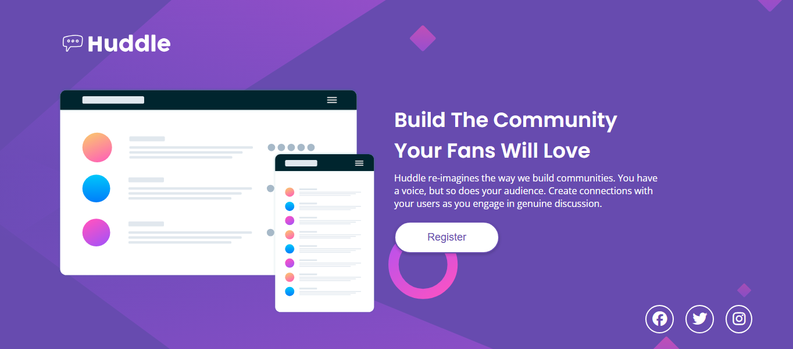
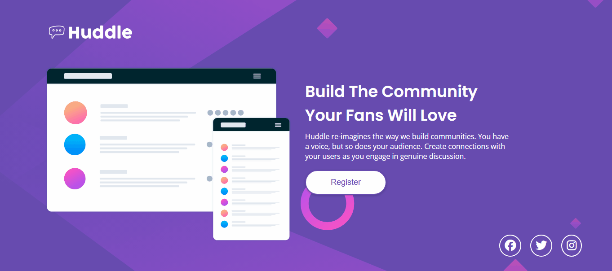

# Projeto Huddle Frontend Mentor 👾

Projeto desenvolvido no avanço do curso DevQuest utilizando o desafio Huddle do Frontend Mentor.

## Tecnologias Utilizadas

- HTML5
- CSS

## Ferramentas

- Font Awesome
- Google Fonts

### Versionamento 

- Git

### hospedagem

- Github

## Estados Ativos

[]

## Desafios e Ideias

Foi interessante testar meus conhecimentos solidos e desenvolver a página sem acesso a recursos como a internet, IA e resumos de estudo. A idéia foi me propor um desafio simples e complexo ao mesmo tempo para testar meu nível de conhecimento verdadeiro. O grid não seria necessário, seria possível simplificar com o flexbox mas nessa ideia e prática percebi a ferramenta valiosa que é o grid e o flexbox em conjunto. 

A responsividade foi o maior desafio. Sem dúvidas foi mais complexo deixar a página responsiva.

## Oque Aprendi de Novo

- Usar uma cor de fundo juntamente com com um background image, eu não sabia.

- A prática do Grid Area

- Aplicação de Box-Shadow no botão

